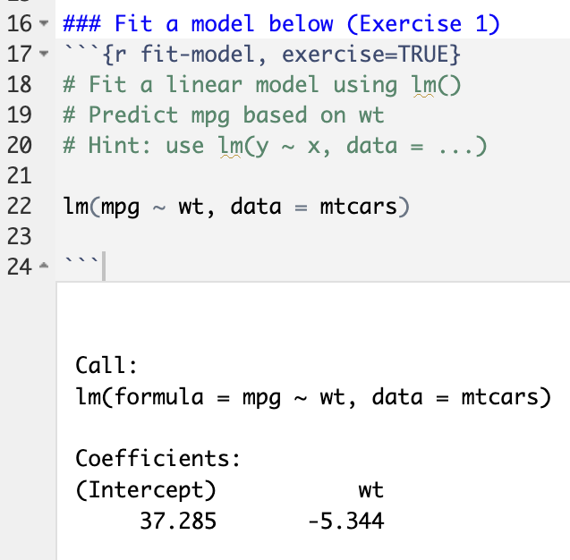
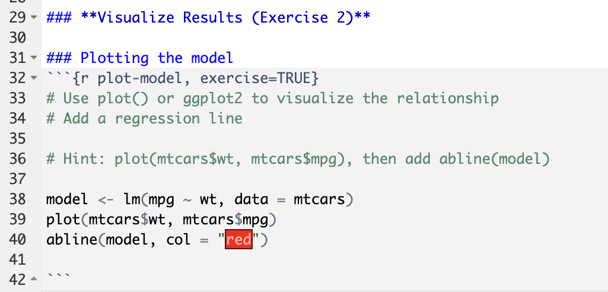
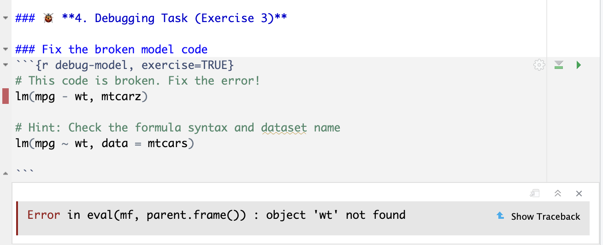
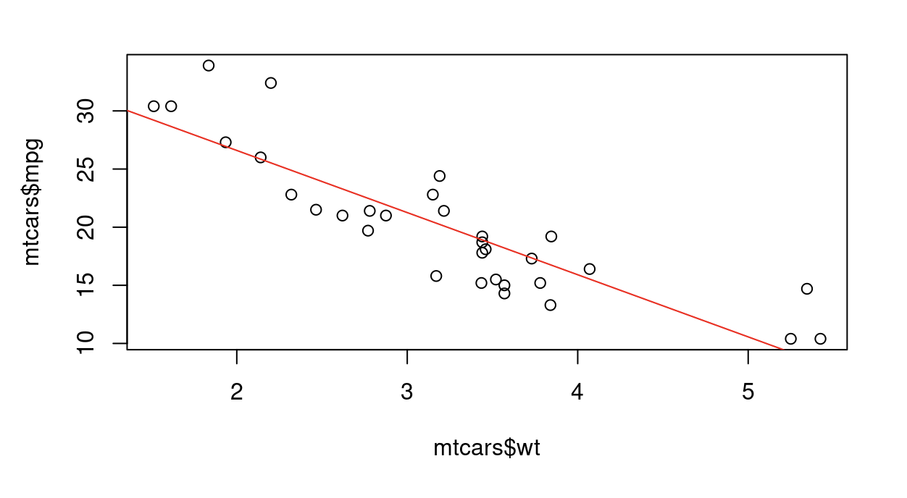

# 📊 Interactive R Tutorial Module — Linear Regression

This repository contains an interactive learning module built using the [`learnr`](https://rstudio.github.io/learnr/) package in R. It simulates a real student-facing module in statistical instruction, aligned with the responsibilities outlined for the **R Module Tester** position (USW 1998 Casual Job Opportunity, Department of Statistical Sciences, UofT).

## 🎯 Project Overview

This tutorial introduces users to **simple linear regression in R** using the built-in `mtcars` dataset. It is structured with:
- Clear instructional sections
- Multiple interactive code exercises
- Guided **hints**, **solutions**, and a **debugging task**
- A focus on **undergraduate user experience**

It reflects core responsibilities of the R Module Tester role, such as:
- Providing constructive feedback on hints and progression
- Identifying and correcting bugs in R code
- Thinking critically from a student’s perspective
- Revising and improving educational modules

---

## 🛠 Features & Structure

- **Section 1:** Introduction to regression and its statistical meaning
- **Section 2:** Fitting a linear model (`lm()` usage)  
- **Section 3:** Visualizing regression with base R and `ggplot2`  
- **Section 4:** Interpreting coefficients  
- **Section 5:** Debugging challenge (simulate a student-side error)

Each section includes:
- At least one interactive exercise
- At least one hint and one solution
- Code-level feedback and error-checking mindset

---

## 📷 Visual Demo

### 🧪 Fitting the model  


### 📈 Plotting with regression line  


### 🐞 Debugging an error  


### 📉 Output graph  


---

## 🚀 How to Run

To view and interact with the tutorial:

1. Open the `.Rmd` file in RStudio.
2. Ensure the following packages are installed:
```r
install.packages("learnr")
